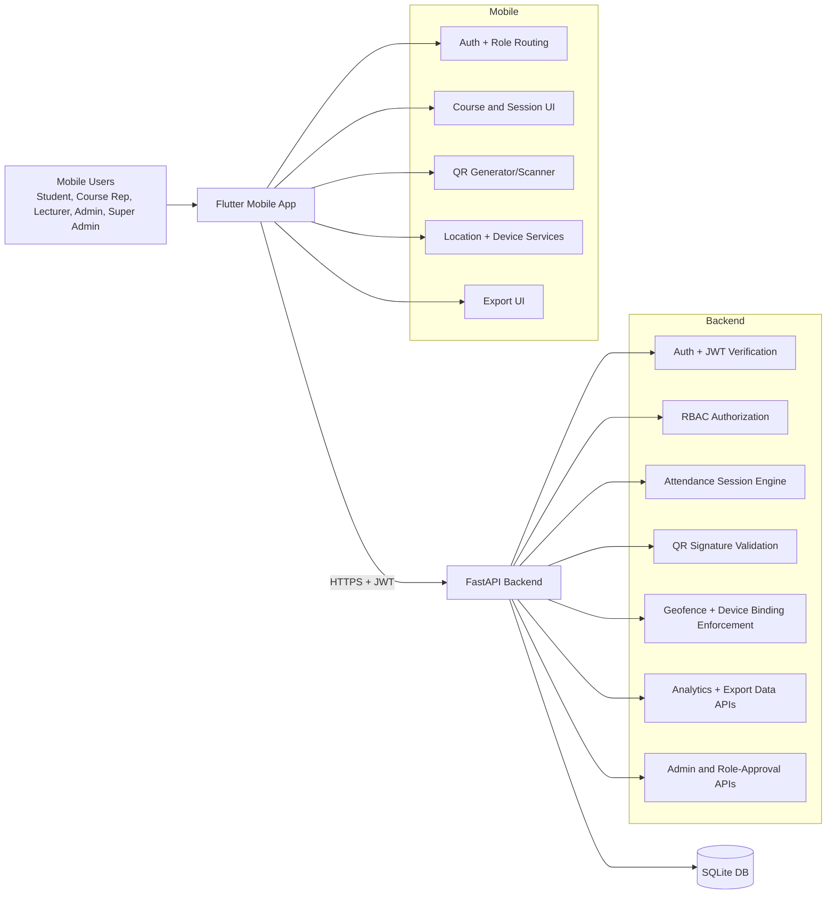

# UniAttend Mobile + Backend Architecture and Requirements Specification

## 1. Purpose and Scope
This document defines the complete reference architecture, role-based behavior, frontend-to-backend endpoint mapping, functional and non-functional requirements, security requirements, and validation approach for the UniAttend system.

System scope includes:
- Flutter Android mobile application
- FastAPI backend API
- SQLite persistence layer
- Attendance security controls (JWT, GPS geofence, rotating QR, device binding)
- Operational verification checks

## 2. High-Level Architecture

## 3. Core Domain Model

Primary entities:
- users: identity, matric number, role, active/blocked state
- role_applications: requested role workflow (pending/approved/rejected)
- courses: course metadata, lecturer assignment, course rep assignment
- course_enrollments: student/course membership
- attendance_sessions: class attendance windows and state transitions
- device_bindings: one-student-to-one-device binding
- attendance_records: check-in/check-out records and attendance status
- attendance_manual_actions: manual overrides (auditable)
- attendance_anomalies: anomaly flags raised by authorized staff

State machine for attendance session:
- pending -> open_for_check_in -> open_for_check_out -> closed

Attendance status progression:
- absent (default/no record)
- partial (check-in completed only)
- present (check-in + check-out completed)

## 4. Roles and Functionalities

### 4.1 Student
- Register/login with university email domain
- Enroll/unenroll in courses
- View own courses and personal attendance history
- Scan check-in and check-out QR codes
- Must satisfy geofence, QR validity, and device-binding checks

### 4.2 Course Rep
- All student capabilities
- Manage assigned course sessions (create/operate/close)
- Generate rotating QR for check-in/check-out phases
- View live attendance records for sessions they manage
- Flag attendance anomalies
- Access analytics and export pages for managed sessions

### 4.3 Lecturer
- Create and manage own course sessions
- Generate rotating QR
- View live attendance, analytics, and session details
- Flag anomalies

### 4.4 Admin
- Manage courses and sessions
- Open checkout and close session
- Manual attendance override
- View analytics and live attendance
- Flag anomalies

### 4.5 Super Admin
- All admin capabilities
- User management: list, edit, block/unblock, delete users
- Role approval workflow (approve/reject role applications)

## 5. Frontend UI to Backend Endpoint Mapping

The table maps mobile screens/actions to backend APIs.

| Mobile UI / Action | Backend Endpoint | Method | Access | Purpose |
|---|---|---|---|---|
| Login page submit | /auth/login | POST | Public | Obtain token and user profile |
| Register page submit | /auth/register | POST | Public | Create account (default student role) |
| Splash/session restore | /auth/me | GET | Authenticated | Refresh current user profile |
| Role status banner | /auth/role-applications/me | GET | Authenticated | Show own role request statuses |
| Home course list | /courses | GET | Authenticated | Get role-scoped course list |
| Public registration course catalog | /courses/catalog (fallback /courses/available, /course-catalog) | GET | Public | Show available courses |
| Enroll in course | /me/courses/{course_id} | POST | Student, Course Rep | Add course enrollment |
| Unenroll from course | /me/courses/{course_id} | DELETE | Student, Course Rep | Remove course enrollment |
| Dashboard analytics card | /analytics/dashboard | GET | Authenticated | Role-scoped summary analytics |
| Course analytics page | /analytics/course/{course_id} | GET | Course-access users | Detailed course analytics |
| Create session (admin dashboard) | /sessions | POST | Staff | Start session in check-in phase |
| Session list by course | /sessions/course/{course_id} | GET | Course-access users | Historical sessions |
| Active session lookup | /sessions/active/{course_id} | GET | Course-access users | Current active session |
| Session detail | /sessions/{session_id} | GET | Session-access users | Session metadata |
| Update session location/time | /sessions/{session_id} | PUT | Session managers | Modify session parameters |
| Open check-out phase | /sessions/{session_id}/open-checkout | POST | Session managers | Move to checkout phase |
| Close session | /sessions/{session_id}/close | POST | Session managers | Finalize session |
| Generate rotating QR page | /sessions/{session_id}/qr?phase=checkin|checkout | GET | Session managers | Server-signed rotating QR payload |
| Student check-in scan | /attendance/checkin | POST | Student account owner | Record check-in (partial) |
| Student check-out scan | /attendance/checkout | POST | Student account owner | Record check-out (present) |
| Live attendance page | /attendance/session/{session_id} | GET | Staff | Session attendance records |
| Personal history page | /attendance/me | GET | Authenticated | Student own attendance records |
| Manual override action | /attendance/manual-add | POST | Admin, Super Admin | Manual presence record |
| Flag anomaly action | /attendance/anomalies | POST | Staff | Record anomaly for audit |
| Super admin user list | /admin/users | GET | Super Admin | User administration |
| Edit user | /admin/users/{target_user_id} | PUT | Super Admin | Update user profile/role |
| Block user | /admin/users/{target_user_id}/block | POST | Super Admin | Disable account |
| Unblock user | /admin/users/{target_user_id}/unblock | POST | Super Admin | Re-enable account |
| Delete user | /admin/users/{target_user_id} | DELETE | Super Admin | Remove user and dependencies |
| Role approvals page list | /admin/role-applications?status=pending | GET | Super Admin | Review pending requests |
| Approve role request | /admin/role-applications/{application_id}/approve | POST | Super Admin | Grant requested role |
| Reject role request | /admin/role-applications/{application_id}/reject | POST | Super Admin | Reject request |
| Service health check | /health | GET | Public | Liveness check |

## 6. Functional Requirements

### FR-01 Two-session attendance with time lock
Requirement:
- Attendance must require check-in and check-out.
- Full attendance only when both are completed.
- Check-out cannot be opened too early.

Implementation status:
- Implemented.
- Session states enforce check-in and check-out phases.
- Backend enforces configurable minimum checkout delay (default 900s).
- check-in sets status partial; checkout upgrades to present.

### FR-02 Device sensor enforcement (GPS + device binding)
Requirement:
- User must be physically near classroom (~50m).
- One device must map to one student account.

Implementation status:
- Implemented.
- Backend geofence enforces 50m radius using classroom coordinates.
- device_bindings table enforces uniqueness on user_id and device_id.
- Backend blocks cross-account device reuse.

### FR-03 Identity lock and anti-duplication
Requirement:
- Permanent matriculation identity, no duplicates.
- Duplicate entries must be impossible.

Implementation status:
- Implemented at database level.
- users.email and users.matric_number are unique.
- Course enrollment uniqueness enforced by (course_id, student_id).

Note:
- Name mutability is currently allowed in super-admin user edit operations.
- If strict immutable name is required per policy, enforce a server-side write guard for student full_name after first registration.

### FR-04 Course Rep administrator controls
Requirement:
- Course rep can open/close sessions and control attendance windows.
- Course rep can flag anomalies.

Implementation status:
- Implemented.
- course_rep role can create/manage sessions for assigned courses.
- course_rep can generate QR and flag anomalies.

### FR-05 QR + sensor hybrid
Requirement:
- Rotating QR every 30 seconds.
- Scan must pass geofence and identity/device rules.

Implementation status:
- Implemented.
- Server generates signed QR payload with rotation window.
- Backend validates signature and freshness (clock-skew tolerant window).
- Check-in/out APIs require QR + GPS + device checks.

### FR-06 Anti-duplication same-name different person
Requirement:
- Matric number is primary uniqueness anchor.

Implementation status:
- Implemented.
- Unique matric number and account identity binding prevent duplicate identity registration.

### FR-07 Course rep and lecturer administrative authority
Requirement:
- Only authorized staff can manage session lifecycle and exports.

Implementation status:
- Implemented with role-guarded route redirection and backend RBAC checks.
- Session management restricted to course managers/admin/super-admin.
- Exports available via staff-only routes in mobile app.

### FR-08 Export format parity with official sheet
Requirement:
- Include course metadata, class type, timestamps, student details.
- Include institutional branding.

Implementation status:
- Implemented.
- Export supports Excel, PDF, CSV.
- Metadata includes course code/name/date/class type/lecturer/delegate/start/end times.
- Student rows include name, matric number, department, phone, check-in/check-out, status.
- PDF/Excel include ICT University heading and logo integration path.

## 7. Security Requirements and Controls

### SR-01 Authentication
- JWT bearer tokens with expiration.
- Password hashing via PBKDF2-HMAC-SHA256 with per-password salt and constant-time compare.

### SR-02 Authorization and RBAC
- Every protected endpoint resolves user identity from token.
- Role checks enforce least privilege for admin/staff functions.

### SR-03 Account status enforcement
- Blocked users are denied login and token-authenticated usage.

### SR-04 QR anti-replay and anti-sharing
- QR payload includes sessionId, courseId, phase, time window, and signature.
- Signature is HMAC-based and validated server-side.
- Window expiry limits screenshot reuse.

### SR-05 Geofence enforcement
- Attendance APIs reject users outside 50m classroom radius.

### SR-06 Device binding
- One-device-per-student enforced server-side with unique constraints.

### SR-07 Auditability
- Manual attendance actions and anomalies are persisted with actor identity and timestamp.

### SR-08 Input and integrity controls
- Pydantic schema validation for request payloads.
- Relational constraints and unique keys enforce consistency.

### SR-09 Biometric gate (policy expectation)
Current status:
- Not currently implemented in active app flow.
- local_auth package exists in dependencies but no runtime biometric authentication usage was detected.

Recommendation:
- Add biometric challenge on login/session resume and before check-in/check-out submission to fully satisfy phone-owner assurance policy.

## 8. Non-Functional Requirements

### NFR-01 Availability
- Health endpoint present for liveness monitoring.
- Startup initializes database schema.

### NFR-02 Performance
- Attendance operations are single-request transaction flows.
- SQLite indexes/uniques support bounded lookups on core keys.

### NFR-03 Reliability and consistency
- Attendance writes use transactional commits.
- Conflict-safe upsert logic for check-in records.

### NFR-04 Security and compliance
- Secure password hashing and JWT authentication.
- RBAC and account blocking controls.

### NFR-05 Usability
- Role-based route guards prevent invalid UI navigation.
- Dedicated staff dashboards for live control and analytics.

### NFR-06 Maintainability
- Layered architecture on Flutter (features/domain/data/presentation).
- Service and repository abstractions.

### NFR-07 Auditability
- Manual actions/anomalies persisted with operator trace.

### NFR-08 Portability
- Mobile app supports Android deployment and ADB installation.
- Backend is standard FastAPI deployment model.

## 9. Validation and Conformance Checks

Automated checks executed:
- Backend health check: PASS (200 with ok=true)
- Backend API regression suite: PASS for auth and admin-user-management flows
- Flutter static analysis: PASS with warnings/info only, no compile-blocking errors listed in this run

Observed notes from latest checks:
- Session creation/attendance path in automated API test was skipped due to no seeded courses in current database state.
- This is consistent with policy to remove demo/mock data.

## 10. Traceability Matrix (Requirement -> Verification)

| Requirement | Verification Method | Current Result |
|---|---|---|
| Two-session attendance with time lock | API behavior + session state transitions + checkout delay guard | Pass |
| GPS geofence <=50m | Backend attendance API guard | Pass |
| Device binding one device one student | device_bindings uniqueness + API checks | Pass |
| Identity anti-duplication | Unique matric/email constraints | Pass |
| Course rep controls | RBAC on session/QR/anomaly endpoints | Pass |
| Rotating QR every 30s | QR rotation constant + signed payload window validation | Pass |
| Staff-only admin operations | RBAC + route protection | Pass |
| Export format official-style | Export service templates and metadata fields | Pass |
| Biometric owner proof | Runtime biometric challenge in app flow | Gap |

## 11. Operational Test Plan to Guarantee Full Conformance

### Step A: Environment
- Start backend and verify health endpoint.
- Install latest mobile APK on device.

### Step B: Role and access tests
- Student cannot access staff routes.
- Course rep can manage assigned courses only.
- Lecturer can manage own courses.
- Super admin can manage users and role approvals.

### Step C: Attendance anti-fraud tests
- Check-in inside geofence with valid QR: must pass.
- Check-in outside geofence: must fail.
- Check-in with expired/wrong-session QR: must fail.
- Same device used by another student account: must fail.
- Check-out before minimum delay opened: must fail.
- Check-in then check-out in valid sequence: must become present.

### Step D: Data integrity tests
- Duplicate matric/email registration: must fail.
- Duplicate attendance in same session for same student: must fail.
- Manual override should be logged in manual action table.
- Anomaly flag should appear in session attendance response.

### Step E: Export tests
- Generate Excel, PDF, CSV for active/closed session.
- Verify all required columns/headers and institutional branding.

## 12. Final Conformance Statement
The system architecture, role model, endpoint design, and core anti-fraud controls satisfy the major attendance requirements, including two-phase attendance, GPS geofence, rotating QR, device-account binding, and role-governed session control.

One policy-level enhancement remains recommended for strict compliance with the stated phone-owner assurance rule:
- Enforce biometric authentication in the active mobile attendance flow.

With this biometric enhancement and continued execution of the operational test plan, the application can meet the stated requirement of functioning fully and securely under production use.
